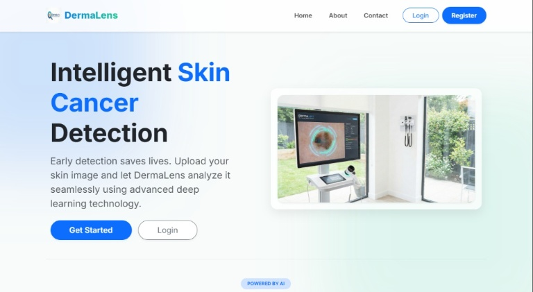
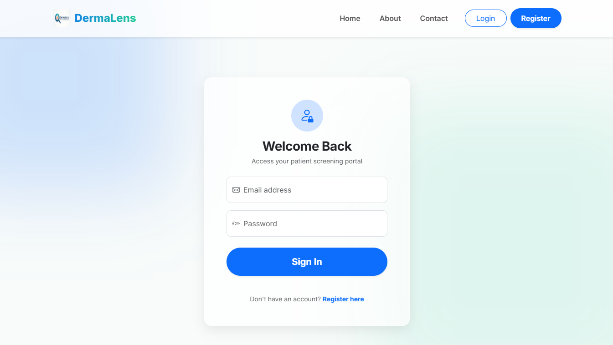
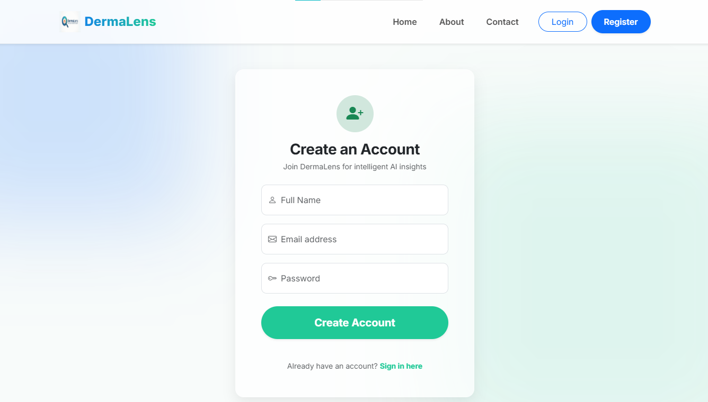
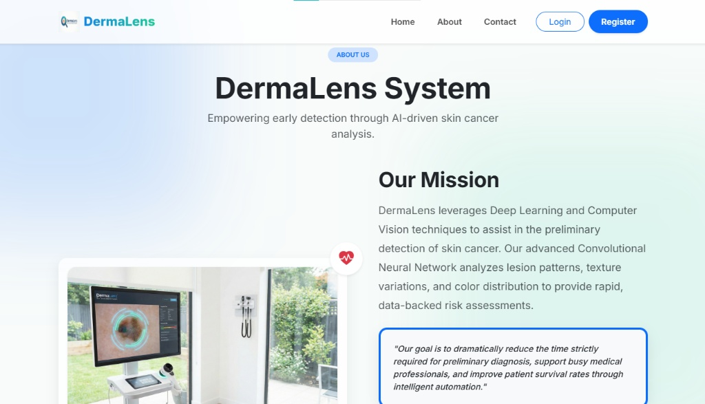
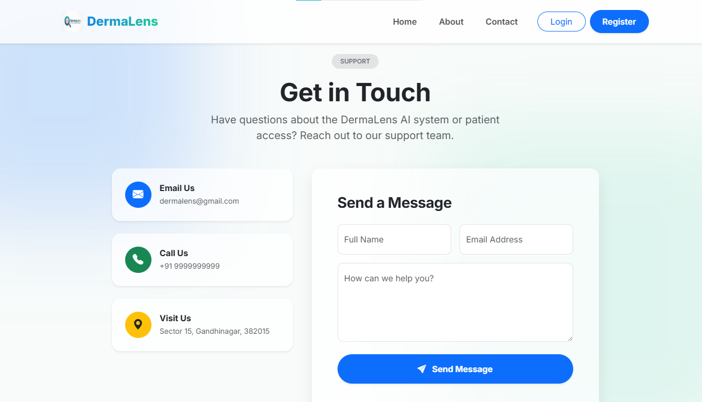
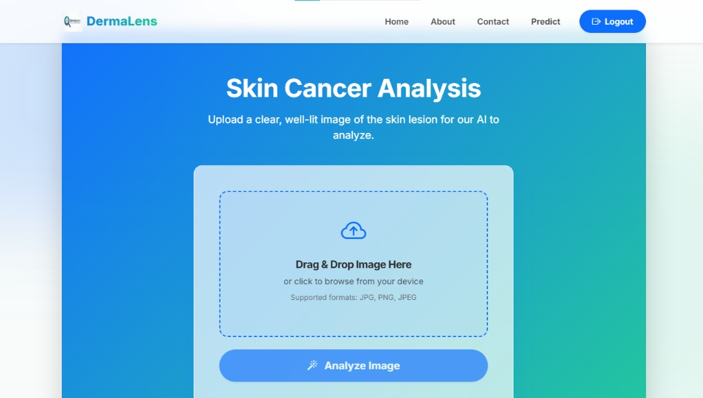
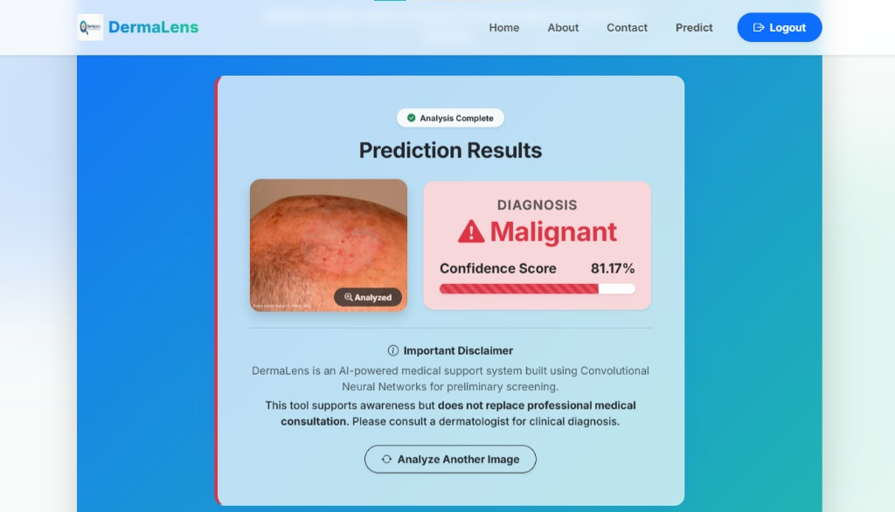
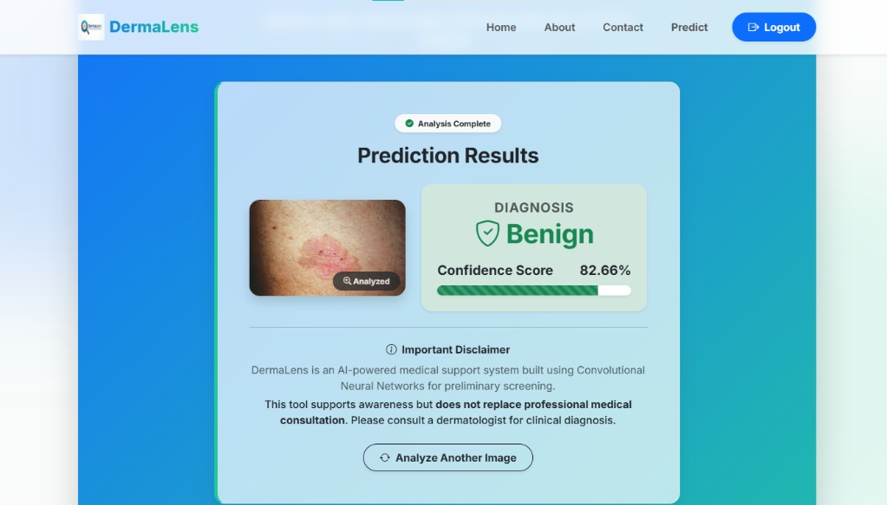

# DermaLens - Skin Cancer Detection System

An AI-powered web application that detects skin cancer from uploaded skin lesion images using a trained Convolutional Neural Network (CNN) and TensorFlow.

---

## Features

- User Registration & Authentication
- Secure Password Hashing
- Skin Cancer Prediction using Deep Learning
- Prediction History Tracking
- Contact Form Support
- REST API Endpoint
- MongoDB Database Integration
- TensorFlow/Keras CNN Model
- Image Upload and Analysis

---

## Tech Stack

### Frontend
- HTML5
- CSS3
- JavaScript

### Backend
- Flask
- Flask RESTful

### Database
- MongoDB

### AI / Machine Learning
- TensorFlow
- Keras
- Convolutional Neural Network (CNN)
- NumPy
- Pillow

---

## Project Structure

```text
DermaLens/
│
├── main.py
├── requirements.txt
├── Dockerfile
├── README.md
├── .gitignore
│
├── screenshots/
│   ├── home.png
│   ├── login.png
│   ├── register.png
│   ├── prediction.png
│   └── result.png
│
├── static/
├── templates/
│
└── skin_cancer_cnn.h5
```

---

## Model

Due to GitHub file size limitations, the trained CNN model is hosted on Hugging Face.

**Model Repository:**

Replace the link below with your actual model URL:

```text
https://huggingface.co/Mitanshu10/dermalens-skin-cancer-model
```

### Download Model

Download:

```text
skin_cancer_cnn.h5
```

and place it in the project root directory:

```text
DermaLens/
├── main.py
├── skin_cancer_cnn.h5
├── templates/
└── static/
```

---

## Installation

### Clone Repository

```bash
git clone https://github.com/MitanshuMakwana/DermaLens.git
cd DermaLens
```

### Create Virtual Environment

```bash
python -m venv dlenv
```

Activate Environment:

**Windows**

```bash
dlenv\Scripts\activate
```

### Install Dependencies

```bash
pip install -r requirements.txt
```

### Configure MongoDB

Ensure MongoDB is running locally.

Default Connection:

```text
mongodb://localhost:27017/dermalens_db
```

### Run Application

```bash
python main.py
```

Open:

```text
http://127.0.0.1:5000
```

---

## Screenshots

### Home Page



### Login Page



### Register Page



### About Page



### Contact Us Page



### Prediction Page



### Prediction Result




---

## REST API

### Predict Endpoint

```http
POST /api/predict
```

Upload an image file and receive:

```json
{
  "success": true,
  "prediction": "Benign",
  "confidence": 96.52
}
```

---

## Docker Support

### Build Image

```bash
docker build -t dermalens .
```

### Run Container

```bash
docker run -p 5000:5000 dermalens
```

Open:

```text
http://localhost:5000
```

---

## Future Improvements

- Multi-Class Skin Disease Classification
- PDF Diagnostic Reports
- Doctor Recommendation System
- Cloud Deployment
- Model Performance Dashboard
- Email Notifications

---

## Author

**Mitanshu**
